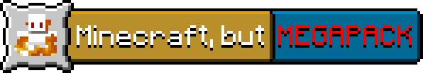
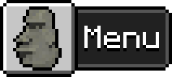

# 
See the PlanetMinecraft page here: https://www.planetminecraft.com/data-packs/5537948

# 
Browsing through [PlanetMinecraft's data pack page](https://www.planetminecraft.com/data-packs/), you will quickly notice the amount of "Minecraft, but" data packs that flood it. You might think all these data packs sound fun. After playing with one, you might want to use several. What if you used 5, 10, 15, even 20 different "Minecraft, but" data packs? You'll quickly find yourself annoyed with having to manually type out `/datapack disable "file/..."`. You will also find it annoying that very few of them are customizable! For the data packs that are customizable, you will often forget how you were supposed to customize them in the first place! Managing several of these data packs quickly turns into a nightmare.

The **Minecraft, but MEGAPACK** aims to solve this problem by providing one centralized menu to manage all your gameplay modifiers. Gone are the days of typing `/datapack`! Gone are the days of having to revisit that PlanetMinecraft page again and again to remind yourself how to configure it! Gone are the days of having to find that inconveniently placed `.txt` file hidden away in the archived data pack file! Gone are the days of a chat flooded by 50 different "Minecraft, but" data packs every time you reload.

# 
## 
The Megapack contains 67 gameplay modifiers (and more on the way), which are essentially "Minecraft, but" scenarios ranging from "Minecraft, but TNT rains from the sky" to "Minecraft, but items randomly fall out of your inventory". The list of modifiers is massive, so bear with me!

Full list of modifiers

    

    
Challenges (challenges)

        - You can't touch grass (or nature) (botanophobia) 
        - You can only eat meat (carnivore) 
        - You always crawl (crawling) 
        - You can't eat meat (herbivore) 
        - You have no inventory (limited_inventory) 
        - You can only look in one direction (look_straight) 
        - You can't leave water (mermaid) 
        - There's no gravity (no_gravity) 
        - You can't touch water (toxic_water) 
        - Light kills you (troglodyte) 
        - Taking damage blinds you (blinding_damage) 
        - All fall damage kills you (deadly_falls) 
        - You can't stop moving (keep_moving) 
    

    

    
Explosions (explosions)

        - All mobs explode like creepers (creeper_mobs) 
        - Creepers are nuclear (creeper_nukes) 
        - Arrows explode (explosive_arrows) 
        - Eggs explode (explosive_eggs) 
        - Everywhere you look explodes (explosive_sight) 
        - Snowballs explode (explosive_arrows) 
        - Bats carry TNT (tnt_bats) 
        - TNT rains from the sky (tnt_rain) 
    

    

    
Chaos (chaos)

        - Anvils rain from the sky (anvil_rain) 
        - The world disintegrates (degradation) 
        - Everything around you turns to fire (fire_walker) 
        - Structures randomly spawn (random_structures) 
        - An orb of death relentlessly follows you (death_orb) 
        - Fire rains from the sky (fire_rain) 
        - Lightning is everywhere (lightning_storm) 
    

    

    
Mechanic (mechanic)

        - You can't jump (no_jump) 
        - You can't sneak (no_sneak) 
        - You can't sprint (schlatt_mode) 
        - You can't kill anything (pacifist) 
    

    

    
Teleporting (teleporting)

        - Players swap places periodically (Death Swap) (death_swap) 
        - You randomly teleport (random_teleport) 
        - Mobs randomly TP to you (mobs_tp_to_you) 
        - You teleport when you get hurt (ender_blood) 
        - You randomly teleport to other dimensions (teleport_chorus) 
    

    

    
Effects (effects)

        - You get random potion effects (random_effects) 
        - Taking damage gives you a random effect (suspicious_injury) 
        - Food gives you random potion effects (potion_food) 
        - Glowing (glowing) 
        - Taking damage nauseates you (damage_nausea) 
        - You are blind. (blindness) 
        - You get faster the more you walk (walk_leveling) 
    

    

    
Mobs (mobs)

        - Phantoms explode (explosive_phantoms) 
        - Bats are OP (op_bats) 
        - Ghasts spawn in the overworld (overworld_ghasts) 
        - Mobs get pigified (pigification) 
        - Pigs turn into piglins (piglinator) 
        - Towers of pigs spawn (stacked_pigs) 
        - Spiders get new abilities (realistic_spiders) 
        - Skeletons fly (flying_skeletons) 
        - Mobs get yeeted (yeet) 
    

    

    
Miscellaneous (misc)

        - You social distance (2020_mode) 
        - Colors kill you (deadly_colors) 
        - Arrows are fast (fast_arrows) 
        - Mobs explode into confetti when they die (confetti_funeral) 
        - Bedrock spawns beneath your feet (bedrock_touch) 
        - OP blocks spawn below your feet (midas_touch) 
        - Time only moves when you move (superhot) 
        - Time randomly freezes (frozen_time) 
    

### 
I aim to make every modifier as customizable as possible. For example, in the "TNT rains from the sky" modifier, you can customize the rate at which the TNT spawns, toggle whether the TNT griefs (automatically set to the mobGriefing gamerule value), and if the TNT spawns from the sky and/or a few blocks above players.

If you want to reset the configuration for a modifier back to the defaults, each configuration option has a reset button that looks like [⟲].

### 
Can't decide what to configure? Many modifiers respect global **Difficulty** and automatically change their configuration values to scale with the **Global Difficulty**, which automatically is set to the world difficulty with **Difficulty Sync**. However, you can input a custom global **Difficulty** which doesn't match the world difficulty. You can even configure the difficulty on a per-modifier basis, using each modifier's **Local Difficulty** -- which is set to the Global Difficulty by default.

### 
Want to disable a modifier or all modifiers for a certain player? In the config menu of each modifier, you will find an option to blacklist a certain player from that modifier. Alternatively, you can blacklist a player from all modifiers in the main config menu. **Players in the spectator gamemode are always blacklisted from almost all modifiers.**

### 
By default, **manual mode** is enabled. **Manual mode** allows you to manually enable or disable modifiers -- the way the pack was meant to be. However, there is support for another mode, **Random Mode**. Random mode randomly selects modifiers. However, it is highly recommended that you just stick with manual mode. Random mode is incredibly chaotic, unbalanced, and even not fun. However, I created it, so it would be a waste of effort to remove it 🤷. So if you have a world you need quickly destroyed, Random Mode is the way to do it.

## 
### 

[A video guide on opening the menu](./assets/menu.mp4)

To open the menu, run the command `/function abchc:give_item`. Bam! Now you have the **Chaos Menu**. With this, just right click to bring up the menu. From here you will find different buttons. All that is important is the "Modifier" button, the "Difficulty" slider, and the "Uninstall" button. You can guess what each button does.

Click on the "Modifier" button to see a list of categories. Feel free to look around these categories. If you need to go back in a menu, just click the back arrow. Now that you've looked around these categories, try enabling a modifier by just clicking on its name or the [X] button.

# 
So many people have helped with this project, it's hard to keep count. Still, here's my best attempt at some sort of "Thank you" list:
- [The Minecraft Commands Discord server](https://discord.gg/QAFXFtZ). These people are awesome.
- [CloudWolfYT](https://cloudwolfyt.github.io/index.html) for his scoreboard tree generator, `is_sky` predicate, and probably more I can't think of.
- [MC Datapack Conventions](https://mc-datapacks.github.io/en/index.html) for conventions to make datapack behave well together
- [Aeldrion](https://github.com/Aeldrion)'s [AESTD tag library](https://github.com/Aeldrion/AESTD-tag-library) for saving me a whole lot of typing and saving my hands and the [Minecraft Random](https://github.com/Aeldrion/Minecraft-Random) library which makes most of these modifiers possible!
- [rx97's distance calculation function](https://github.com/rx-modules/gists/blob/main/dist/dist.mcfunction)
- [SkylinerW's raycast function generator](https://www.skylinerw.com/vdvman1/raycast/) based on [vdvman1's raycast functions](https://discordapp.com/channels/154777837382008833/157097006500806656/537829416894595083) in the [Minecraft Commands Discord server](https://discord.gg/QAFXFtZ)
- [Cylinderbox](planetminecraft.com/member/cylinderbox/)'s [Minecraft, but colors are deadly](https://planetminecraft.com/data-pack/minecraft-but-colors-are-deadly/) datapack which served as inspiration for the "Colors are deadly" modifier
- any future contributors to this datapack
- and the obligatory **YOU** for reading this and hopefully playing my data pack! You're the reason I make them!

# 🏷️ Todo / Future
For plans for the future of this datapack, please view the [GitHub project for this datapack](https://github.com/users/AmericanBagel/projects/2/views/1) or refer to the issues.

# 👥 Contributing
Feel free to contribute. Any help is appreciated. If it's something as simple as removing an unnecessary `at @s` or even just cleaning up comments, it helps a lot!

If you're no good with git and GitHub and commands, I totally understand! You can, however, suggest a modifier in the Issues page! Just give it the 'modifier' and 'enhancement' tags!
